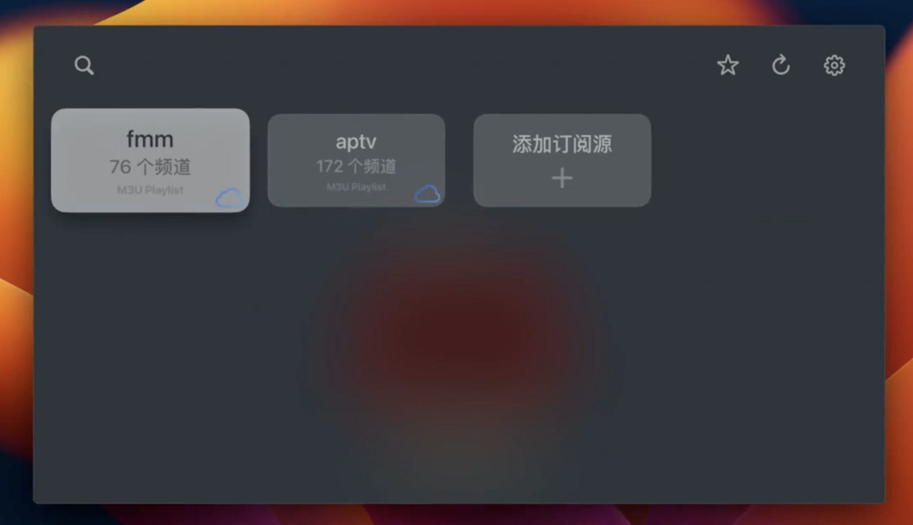

# 🎬 X-IPTV Player

<div align="center">



一个现代化的跨平台 IPTV 播放器，采用 Apple 风格设计理念打造优雅的观看体验

[](https://opensource.org/licenses/MIT)
[](https://nodejs.org/)
[](https://electronjs.org/)
[](https://vuejs.org/)

[功能特色](#-功能特色) • [快速开始](#-快速开始) • [使用指南](#-使用指南) • [开发](#-开发) • [常见问题](#-常见问题)

</div>

---

## ✨ 功能特色

### 🎥 专业级播放体验
- **多格式支持** - 完美支持 M3U/M3U8 播放列表格式
- **高质量解码** - 基于 HLS.js 和 mpegts.js 的专业视频播放引擎
- **智能适配** - 自动检测最佳播放模式，确保流畅播放

### 🎨 现代化界面设计
- **Apple 风格** - 精致的毛玻璃效果和流畅动画
- **响应式布局** - 完美适配各种屏幕尺寸
- **直观操作** - 卡片式播放列表管理，一目了然

### 🚀 高性能优化
- **虚拟滚动** - 轻松处理数千个频道的大型播放列表
- **智能缓存** - 优化播放性能，减少缓冲等待
- **内存管理** - 自动清理资源，保持应用流畅运行

### 🔍 智能管理功能
- **快速搜索** - 支持播放列表和频道的实时搜索
- **重复检测** - 自动识别并清理重复的播放源
- **数据持久化** - 安全保存您的播放列表配置

## 🚀 快速开始

### 系统要求

- **Node.js** v22.10.0 或更高版本
- **操作系统** macOS 10.14+ / Windows 10+ / Linux

### 一键安装

```bash
# 克隆项目
git clone https://github.com/your-username/x-iptv-player.git
cd x-iptv-player

# 安装依赖
npm install

# 启动开发版本
npm run electron:dev
```

### 快速打包

```bash
# 构建应用
npm run build

# 打包桌面应用
npm run dist

# 平台特定打包
npm run electron:build:mac     # macOS DMG
npm run electron:build:win     # Windows EXE  
npm run electron:build:linux   # Linux AppImage
```

## 📖 使用指南

### 添加播放源

<table>
<tr>
<td width="50%">

**在线播放列表**
1. 点击 "+" 添加播放源
2. 输入 M3U/M3U8 播放列表 URL
3. 应用会自动解析并添加所有频道

</td>
<td width="50%">

**本地文件**
1. 选择 "本地文件" 选项
2. 浏览并选择本地 M3U/M3U8 文件
3. 文件内容会被导入到应用中

</td>
</tr>
</table>

### 播放控制

- **开始播放** - 点击任意频道即可开始观看
- **快速搜索** - 使用搜索栏快速定位频道
- **列表管理** - 支持显示/隐藏频道列表
- **频道导航** - 频道按序号排序，便于浏览

### 高级功能

| 功能 | 描述 | 快捷操作 |
|------|------|----------|
| 编辑播放源 | 修改播放列表名称和地址 | 悬停卡片 → 编辑按钮 |
| 删除播放源 | 移除不需要的播放列表 | 悬停卡片 → 删除按钮 |
| 开发者工具 | 查看应用运行日志 | 设置菜单 → 开发者工具 |
| 清理重复 | 自动检测重复播放源 | 设置菜单 → 清理重复播放源 |

## 🛠 开发

### 项目架构

```
x-iptv-player/
├── 🎯 src/                    # 核心源码
│   ├── App.vue               # 主应用组件
│   ├── main.js               # Vue 入口文件  
│   ├── components/           # Vue 组件库
│   └── assets/              # 静态资源
├── ⚡ scripts/               # 构建脚本
├── 🔧 main.js               # Electron 主进程
├── 🔒 preload.js            # 安全预加载脚本
└── ⚙️ vite.config.js        # Vite 构建配置
```

### 技术栈

<div align="center">

| 分类 | 技术 | 版本 | 说明 |
|------|------|------|------|
| **桌面框架** | Electron | v25+ | 跨平台桌面应用 |
| **前端框架** | Vue 3 | v3.3+ | 组合式 API |
| **构建工具** | Vite | v4+ | 快速热重载 |
| **视频播放** | HLS.js | v1.5+ | HTTP Live Streaming |
| | mpegts.js | v1.8+ | MPEG-TS 流支持 |
| **状态管理** | electron-store | v8+ | 数据持久化 |

</div>

### 开发命令

```bash
# 开发环境
npm run electron:dev          # 启动开发服务器
npm run dev                   # 仅启动 Web 版本
npm run dev:port -- --port 3005  # 指定端口

# 构建部署  
npm run build                 # 构建 Web 应用
npm run dist                  # 打包桌面应用
npm run pack                  # 仅打包不分发

# 维护工具
npm run postinstall          # 重建原生依赖
```

### 调试工具

- **实时日志** - 内置日志面板，实时查看应用状态
- **开发者工具** - 可通过设置菜单一键开启 DevTools
- **详细模式** - 支持显示详细的网络和解码日志

## 🔧 配置说明

### 支持格式

- **M3U** - 标准 M3U 播放列表格式
- **M3U8** - HTTP Live Streaming 播放列表
- **单流地址** - 直接的视频流 URL

### 网络要求

- **协议支持** - HTTP/HTTPS/RTMP/RTSP
- **跨域处理** - 自动处理 CORS 问题
- **代理支持** - 支持系统代理设置

### 性能优化

- **虚拟滚动** - 大列表（>1000 项）自动启用
- **智能预加载** - 提前建立服务器连接
- **内存清理** - 自动清理播放器实例

## 🐛 常见问题

<details>
<summary><strong>🎥 播放相关问题</strong></summary>

**Q: 视频无法播放？**
A: 请检查：
1. 播放源地址是否有效
2. 网络连接是否正常  
3. 查看日志面板获取详细错误信息

**Q: 播放卡顿？**  
A: 建议：
1. 确保网络环境稳定
2. 关闭其他占用带宽的应用
3. 尝试切换到其他播放源

</details>

<details>
<summary><strong>⚙️ 应用启动问题</strong></summary>

**Q: 应用无法启动？**
A: 请尝试：
1. 确认 Node.js 版本 ≥ v22.10.0
2. 清理并重新安装依赖：`rm -rf node_modules && npm install`
3. 检查端口 3000-3010 是否被占用

**Q: 图标不显示？**
A: 解决方案：
1. 确认 `src/assets/electron.icns` 文件存在
2. 检查 `package.json` 中图标路径配置
3. 重新构建应用：`npm run dist`

</details>

<details>
<summary><strong>🔧 其他问题</strong></summary>

**Q: 如何导入大量播放源？**
A: 支持批量导入：
1. 准备标准格式的 M3U 文件
2. 使用"本地文件"方式导入
3. 应用会自动解析所有频道

**Q: 播放源重复怎么办？** 
A: 自动检测：
1. 打开设置菜单
2. 点击"清理重复播放源"  
3. 系统会自动清理重复项

</details>

## 📄 开源协议

本项目基于 [MIT License](LICENSE) 开源协议，您可以自由使用、修改和分发。

## 🤝 参与贡献

我们欢迎所有形式的贡献！

- 🐛 [报告 Bug](https://github.com/your-username/x-iptv-player/issues)
- 💡 [提出新功能](https://github.com/your-username/x-iptv-player/issues)
- 📖 改进文档
- 🔀 提交 Pull Request

## 🌟 支持项目

如果这个项目对您有帮助，请考虑：

- ⭐ 给项目点个 Star
- 🔄 分享给其他开发者
- 💝 [赞助开发](https://github.com/sponsors/your-username)

---

<div align="center">

**Made with ❤️ by X-IPTV Player Team**

[🏠 官网](https://your-website.com) • [📱 下载](https://github.com/your-username/x-iptv-player/releases) • [📧 反馈](mailto:your-email@example.com)

</div>